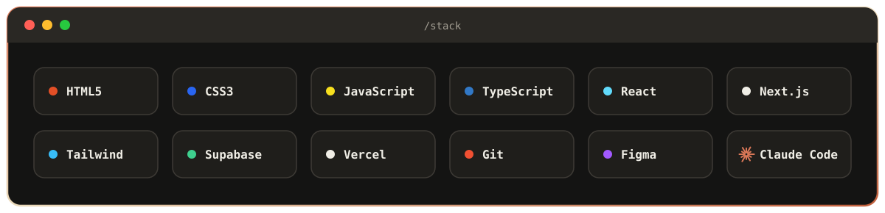
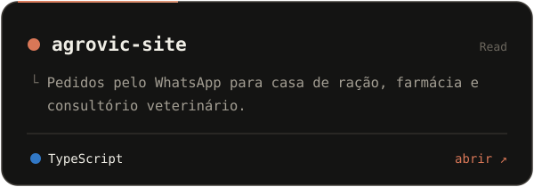
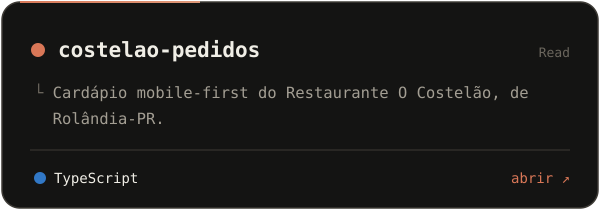
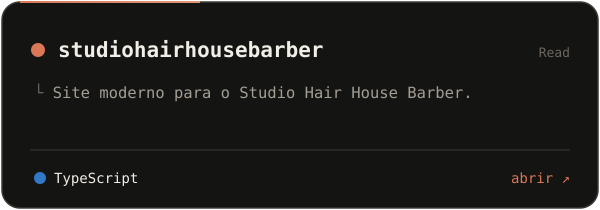
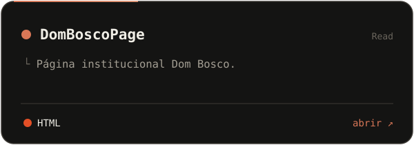
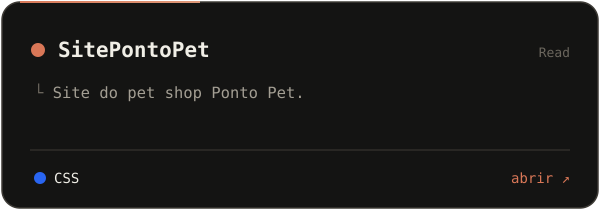
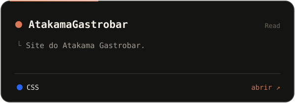

  

<picture>
  <source media="(prefers-color-scheme: dark)" srcset="https://raw.githubusercontent.com/gniza/gniza/output/github-snake-dark.svg">
  <source media="(prefers-color-scheme: light)" srcset="https://raw.githubusercontent.com/gniza/gniza/output/github-snake.svg">
  
</picture>

Precisa de um site para o seu negócio? Dá uma olhada nos projetos acima ou abre uma [issue](https://github.com/gniza/gniza/issues) por aqui. ✻

Perfil construído em parceria com o <a href="https://claude.com/claude-code">Claude Code</a>. Os SVGs são gerados por <a href="scripts/gerar_assets.py"><code>scripts/gerar_assets.py</code></a>.

