<div align="center">

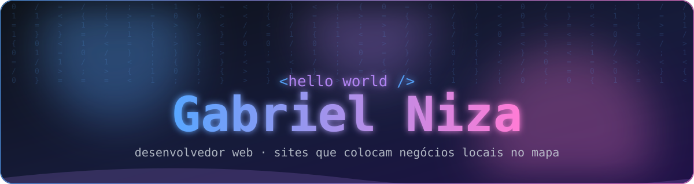


<br>

<a href="https://github.com/gniza?tab=repositories"></a>



</div>

## 👋 Sobre mim

```ts
const gabriel = {
  nome: "Gabriel Niza",
  local: "Rolândia, Paraná 🇧🇷",
  trabalho: "Crio sites e cardápios online para negócios locais",
  especialidade: ["mobile-first", "pedidos pelo WhatsApp", "visual moderno"],
  aprendendo: ["Next.js", "Supabase", "animações com CSS/SVG"],
  objetivo: "colocar o comércio da minha cidade na internet 🚀",
};
```

<div align="center">

</div>

## 🛠️ Tecnologias

<div align="center">
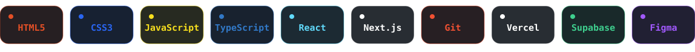
</div>

<div align="center">

</div>

## 🚀 Projetos em destaque

<div align="center">
<table>
  <tr>
    <td><a href="https://github.com/gniza/agrovic-site">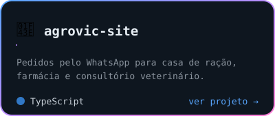</a></td>
    <td><a href="https://github.com/gniza/costelao-pedidos">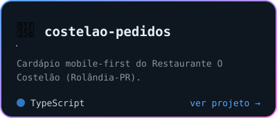</a></td>
  </tr>
  <tr>
    <td><a href="https://github.com/gniza/studiohairhousebarber">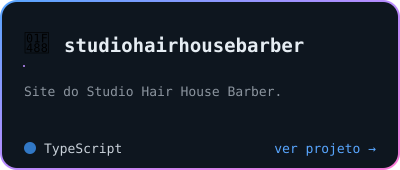</a></td>
    <td><a href="https://github.com/gniza/DomBoscoPage">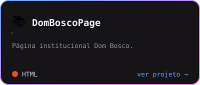</a></td>
  </tr>
  <tr>
    <td><a href="https://github.com/gniza/SitePontoPet">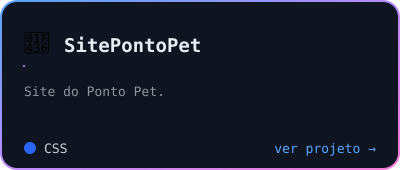</a></td>
    <td><a href="https://github.com/gniza/AtakamaGastrobar">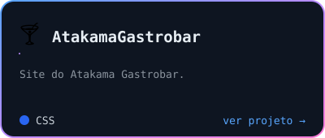</a></td>
  </tr>
</table>
</div>

<div align="center">

</div>

## 🤖 Feito com Claude Code

<div align="center">
<br>
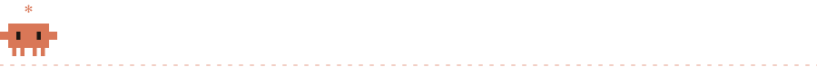
<br>
<sub>Este perfil foi construído em parceria com o <a href="https://claude.com/claude-code">Claude Code</a> ✻</sub>
</div>

<div align="center">

</div>

## 🐍 Minhas contribuições

<div align="center">
<picture>
  <source media="(prefers-color-scheme: dark)" srcset="https://raw.githubusercontent.com/gniza/gniza/output/github-snake-dark.svg">
  <source media="(prefers-color-scheme: light)" srcset="https://raw.githubusercontent.com/gniza/gniza/output/github-snake.svg">
  
</picture>
</div>

<div align="center">

## 💬 Vamos conversar?

Precisa de um site para o seu negócio? Dá uma olhada nos projetos acima ou abre uma [issue](https://github.com/gniza/gniza/issues) por aqui.


</div>
