


  

## 🛍️ Sobre a NizaShop

A **NizaShop** é uma loja na **Shopee** feita para quem gosta de comprar bem: produtos escolhidos a dedo, preço justo, envio rápido e cada pedido embalado com carinho.

Por trás da loja está **[Gabriel Niza](https://github.com/gniza)**, **fundador e CEO**, que cuida de tudo: da curadoria dos produtos ao tráfego com IA que leva a loja até quem procura por ela.

A loja foi criada com a ajuda de três ferramentas de IA: **[Claude](https://claude.ai)**, **[Gemini](https://gemini.google.com)** e **[TryBloom](https://www.trybloom.ai)**.

## 👤 Fundador & CEO

<table>
  <tr>
    <td width="96">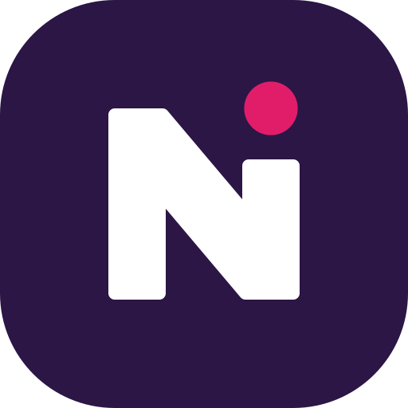</td>
    <td>
      <b>Gabriel Niza</b>, fundador e CEO da NizaShop 
      Desenvolvedor web e especialista em tráfego com IA na Shopee. 
      <a href="https://github.com/gniza">github.com/gniza</a>
    </td>
  </tr>
</table>

## 🎉 Campanhas

 

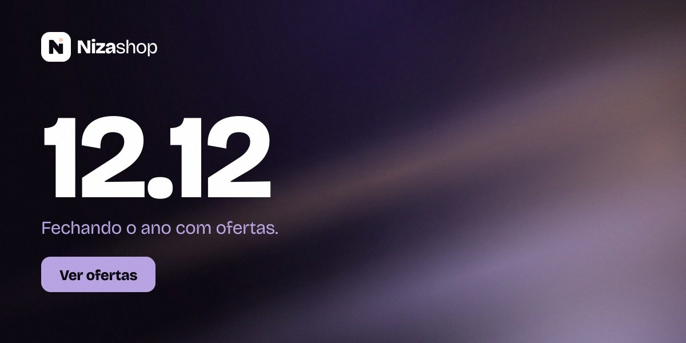
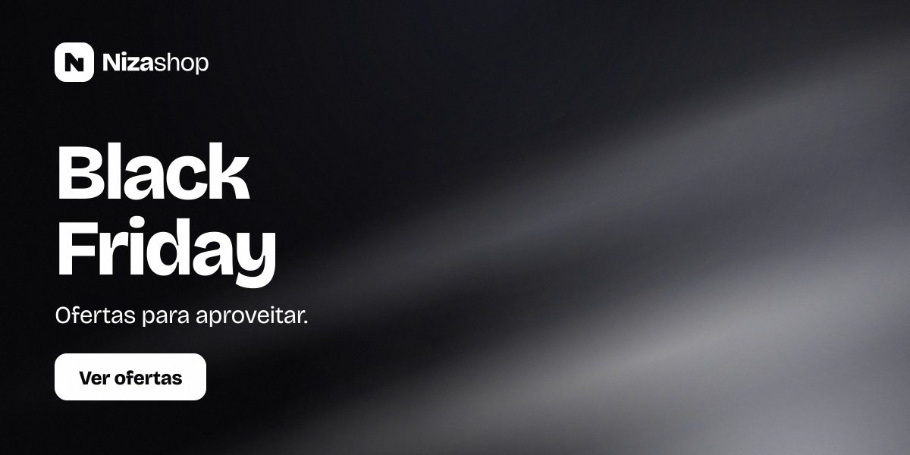

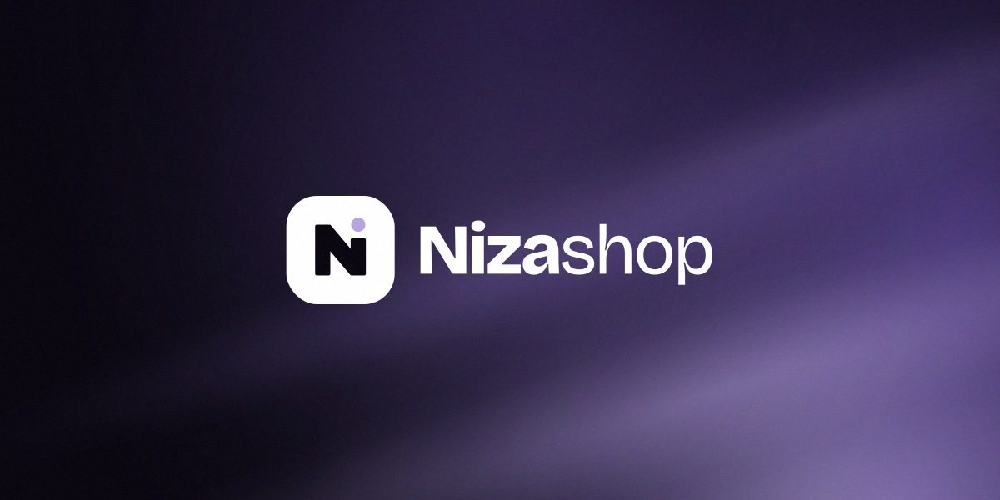

## 🎨 Identidade visual

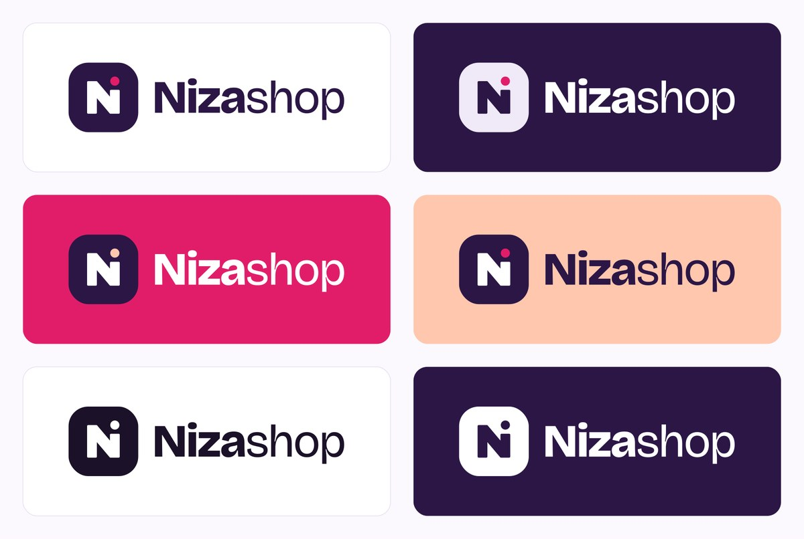

Arquivos vetoriais de cada versão em <a href="assets/logos/">assets/logos/</a>.
  

## 📦 Kit de embalagem

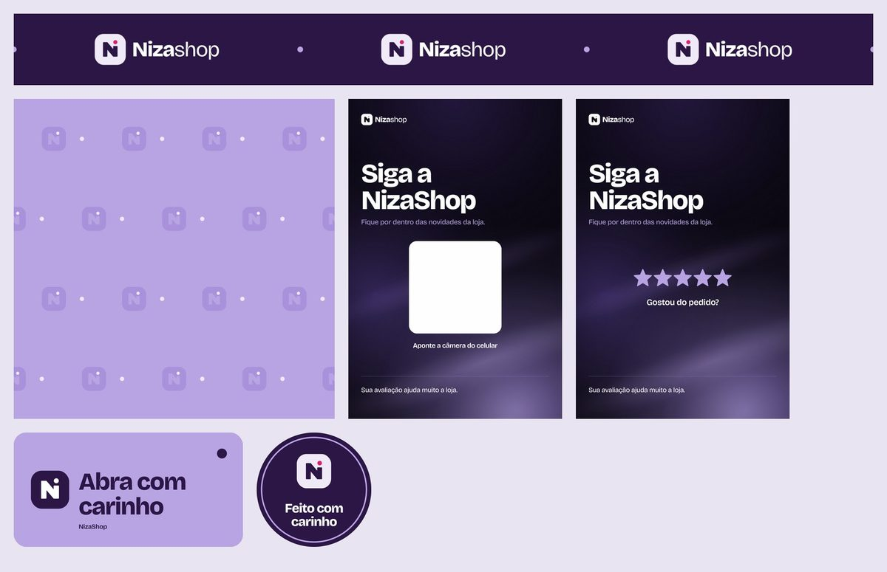

## 📱 Planos de fundo

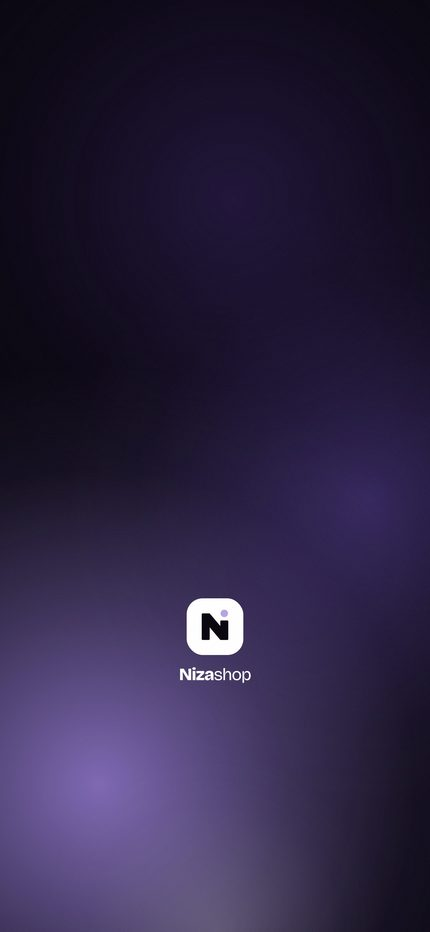
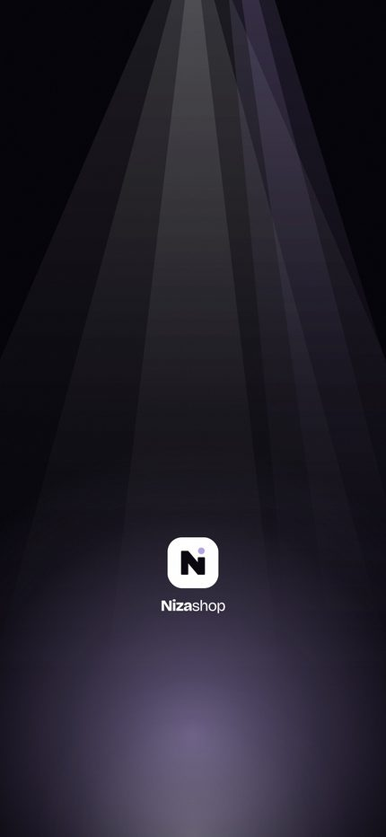
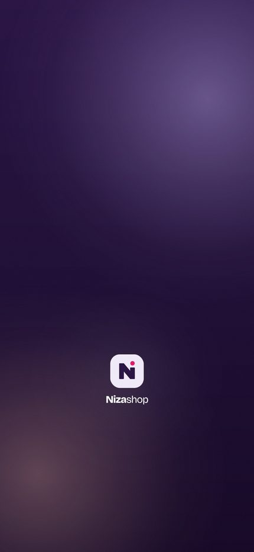
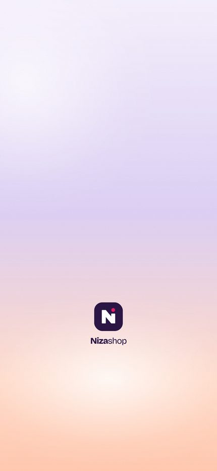

 

Identidade visual criada com <a href="https://www.trybloom.ai">TryBloom</a> · página feita com <a href="https://claude.com/claude-code">Claude Code</a> · <a href="../README.md">voltar ao perfil</a>

